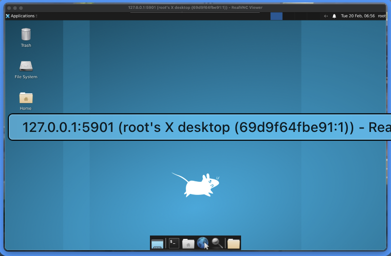

# vncserver-docker

## Docker
**Docker**

* Docker is an open platform for developing, shipping, and running applications.
* Docker supports packaging and running applications in an isolated environment called a container. This isolation and security allow multiple containers to run simultaneously on the same host.

**Docker-compose**

* Docker-compose is a tool used to define and run multi-container Docker applications.

## OS
**Unix**
* Unix is a stable, multi-user, multitasking operating system developed in the early 1960s.
* Unix has many different versions, although they share common similarities. The most popular versions today are Sun Solaris, GNU/Linux, and MacOSX.

**Linux**

* Linux is a Unix-like operating system kernel created by Linus Torvalds in 1991. The Linux kernel is used in combination with components from the GNU operating system to create a complete Linux OS. Linux distributions like Ubuntu, Fedora, etc., bundle the Linux kernel with different user interfaces and software.

**BSD (Berkeley Software Distribution)**

* BSD is a family of Unix-like operating systems developed at the University of California, Berkeley.

***nix**

* This includes all operating systems that share similarities with the original Unix design, such as Linux, BSD, and macOS.
macOS is designed based on a Unix-like platform called Darwin, combined with components from the FreeBSD operating system. Thus, macOS belongs to the *nix family.

## Alpine vs Ubuntu

* Both Alpine and Ubuntu are Linux distributions. However, Alpine is typically smaller and lightweight, making it ideal for packaging images and is commonly used for container environments (Docker) or embedded systems. On the other hand, Ubuntu is heavier and focuses on security, frequent updates, and patching, making it suitable for desktops, servers, or cloud infrastructure.

## VNC
VNC, or Virtual Network Computing, is a protocol that allows remote control and usage of a computer. The VNC system enables a server to share its screen and control it with one or more clients over a network.
